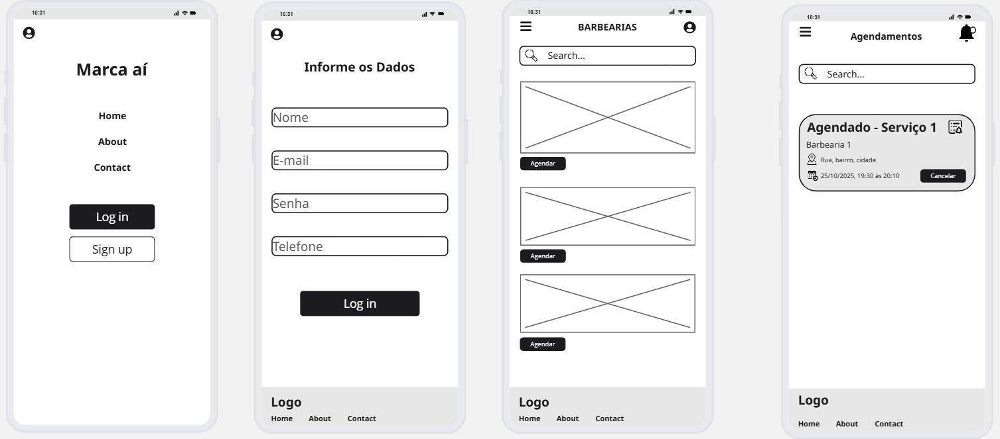
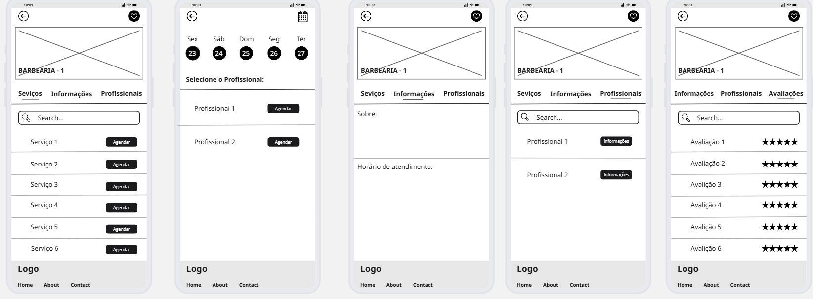

## 4. Projeto da Solução

Pré-requisitos: <a href="03-Modelagem do Processo de Negocio.md"> Modelagem do Processo de Negocio</a>

## 4.1. Arquitetura da solução

......  COLOQUE AQUI O SEU TEXTO E O DIAGRAMA DE ARQUITETURA .......

 Inclua um diagrama da solução e descreva os módulos e as tecnologias
 que fazem parte da solução. Discorra sobre o diagrama.
 
 **Exemplo do diagrama de Arquitetura**:
 
 
 

## 4.2. Protótipos de telas 

- **Tela inicial/login**: acesso às opções `Log in` e `Sign up`.  
- **Lista de barbearias**: exibe barbearias cadastradas com barra de busca.  
- **Página da barbearia**: organizada em abas:
  - **Serviços** → lista serviços disponíveis com botão de **Agendar**.  
  - **Informações** → dados gerais e horários de funcionamento.  
  - **Profissionais** → lista barbeiros, com detalhes e opção de seleção.  
  - **Avaliações** → feedback de clientes em formato de estrelas.  

  

## Diagrama de Classes

O diagrama de classes ilustra graficamente como será a estrutura do software, e como cada uma das classes da sua estrutura estarão interligadas. Essas classes servem de modelo para materializar os objetos que executarão na memória.

As referências abaixo irão auxiliá-lo na geração do artefato “Diagrama de Classes”.

> - [Diagramas de Classes - Documentação da IBM](https://www.ibm.com/docs/pt-br/rational-soft-arch/9.6.1?topic=diagrams-class)
> - [O que é um diagrama de classe UML? | Lucidchart](https://www.lucidchart.com/pages/pt/o-que-e-diagrama-de-classe-uml)

## Modelo ER

O Modelo ER representa através de um diagrama como as entidades (coisas, objetos) se relacionam entre si na aplicação interativa.

As referências abaixo irão auxiliá-lo na geração do artefato “Modelo ER”.

> - [Como fazer um diagrama entidade relacionamento | Lucidchart](https://www.lucidchart.com/pages/pt/como-fazer-um-diagrama-entidade-relacionamento)

### 4.3. Modelo de dados

O desenvolvimento da solução proposta requer a existência de bases de dados que permitam efetuar os cadastros de dados e controles associados aos processos identificados, assim como recuperações.
Utilizando a notação do DER (Diagrama Entidade e Relacionamento), elaborem um modelo, na ferramenta visual indicada na disciplina, que contemple todas as entidades e atributos associados às atividades dos processos identificados. Deve ser gerado um único DER que suporte todos os processos escolhidos, visando, assim, uma base de dados integrada. O modelo deve contemplar, também, o controle de acesso de usuários (partes interessadas dos processos) de acordo com os papéis definidos nos modelos do processo de negócio.

#### 4.3.1 Modelo ER

#### 4.3.2 Esquema Relacional

#### 4.3.3 Modelo Físico

<code>
-- Criação da tabela Agenda

CREATE TABLE `agenda` (
  `id_agenda` int NOT NULL AUTO_INCREMENT,
  `data_agenda` date NOT NULL,
  `hora` time NOT NULL,
  `cnpj_barbearia` varchar(14) DEFAULT NULL,
  `cpf_cliente` varchar(11) DEFAULT NULL,
  `cpf_profissionall` varchar(11) DEFAULT NULL,
  `id_servico` int DEFAULT NULL,
  PRIMARY KEY (`id_agenda`)
)

-- Criação da tabela Barbearia

CREATE TABLE `barbearia` (
  `cnpj_barbearia` varchar(14) NOT NULL,
  `nome` varchar(100) NOT NULL,
  `email` varchar(150) NOT NULL,
  `celular` varchar(17) NOT NULL,
  `uf` char(2) NOT NULL,
  `cidade` varchar(60) NOT NULL,
  `cep` varchar(8) NOT NULL,
  `bairro` varchar(60) NOT NULL,
  `rua` varchar(60) NOT NULL,
  `numero` varchar(5) NOT NULL,
  PRIMARY KEY (`cnpj_barbearia`),
  UNIQUE KEY `email` (`email`)
)

-- Criação da tabela Cadastro Barbearia

CREATE TABLE `cadastro_barbearia` (
  `id_barbearia` bigint unsigned NOT NULL AUTO_INCREMENT,
  `nome` varchar(100) NOT NULL,
  `email` varchar(150) NOT NULL,
  `senha` varchar(255) NOT NULL,
  `cnpj` varchar(14) NOT NULL,
  PRIMARY KEY (`id_barbearia`),
  UNIQUE KEY `id_barbearia` (`id_barbearia`),
  UNIQUE KEY `nome` (`nome`),
  UNIQUE KEY `email` (`email`)
)

-- Criação da tabela Cliente

CREATE TABLE `cliente` (
  `cpf_cliente` varchar(11) NOT NULL,
  `nome` varchar(100) NOT NULL,
  `senha` varchar(255) NOT NULL,
  `email` varchar(150) NOT NULL,
  `celular` varchar(20) NOT NULL,
  `usuario` varchar(100) NOT NULL,
  PRIMARY KEY (`cpf_cliente`),
  UNIQUE KEY `email` (`email`)
) 

-- Criação da tabela Profissional

CREATE TABLE `profissional` (
  `cpf_profissional` varchar(11) NOT NULL,
  `usuario` varchar(100) NOT NULL,
  `nome` varchar(100) NOT NULL,
  `senha` varchar(255) NOT NULL,
  `email` varchar(150) NOT NULL,
  `celular` varchar(17) NOT NULL,
  PRIMARY KEY (`cpf_profissional`),
  UNIQUE KEY `email` (`email`)
) 

-- Criação tabela Serviços

CREATE TABLE `servicos` (
  `id_servico` int NOT NULL,
  `nome` varchar(100) NOT NULL,
  `preco` decimal(4,2) NOT NULL,
  PRIMARY KEY (`id_servico`)
)  
</code>

Este script deverá ser incluído em um arquivo .sql na pasta src\bd.

### 4.4. Tecnologias

_Descreva qual(is) tecnologias você vai usar para resolver o seu problema, ou seja, implementar a sua solução. Liste todas as tecnologias envolvidas, linguagens a serem utilizadas, serviços web, frameworks, bibliotecas, IDEs de desenvolvimento, e ferramentas._

Apresente também uma figura explicando como as tecnologias estão relacionadas ou como uma interação do usuário com o sistema vai ser conduzida, por onde ela passa até retornar uma resposta ao usuário.

| **Dimensão**   | **Tecnologia**  |
| ---            | ---             |
| SGBD           | MySQL           |
| Front end      | HTML+CSS+JS     |
| Back end       | Java SpringBoot |
| Deploy         | Github Pages    |

