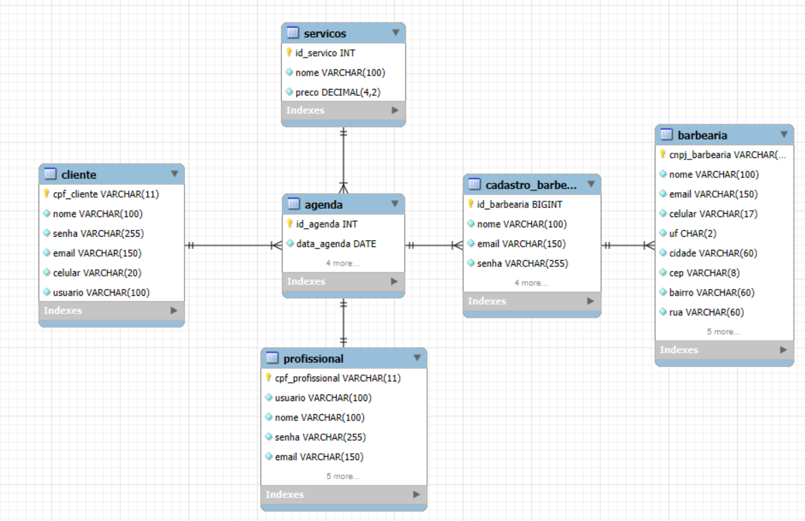

## 4. Projeto da Solução

## 4.1. Arquitetura da solução
 
 **Diagrama da Solução - Descrição**:

A solução é composta por três módulos principais: Frontend, Backend e Banco de Dados, conforme mostrado no diagrama.

1. Frontend (Apresentação)
- Tecnologias: HTML5, CSS3 e JavaScript
- Função: interface com o usuário, envio de requisições HTTP ao backend e exibição das respostas.
- Hospedagem: Vercel

2. Backend (Aplicação PHP)
- Tecnologia: PHP
- Função: processar requisições, aplicar regras de negócio e se comunicar com o banco de dados.
- Conexão com MySQL: feita via PDO, que é o driver nativo do PHP para conexões seguras.

3. Banco de Dados (MySQL)
- Tecnologia: MySQL Server
- Função: armazenamento e gerenciamento de dados da aplicação.
- Acesso via PDO enviado pelo backend PHP.

Fluxo Resumido
1. O usuário acessa o site pelo navegador.
2. O frontend envia requisições HTTP para o backend PHP.
3. O PHP consulta ou atualiza o MySQL usando PDO.
4. O banco devolve os dados para o PHP, que responde ao navegador.
 
 **Diagrama da Arquitetura**:

 

## 4.2. Protótipos de telas 

[PROCESSO 1 - Cadastro de Usuário](./images/wireframe/Wireframe-01.jpg)

## Diagrama de Classes

O diagrama de classes ilustra graficamente como será a estrutura do software, e como cada uma das classes da sua estrutura estarão interligadas. Essas classes servem de modelo para materializar os objetos que executarão na memória.

As referências abaixo irão auxiliá-lo na geração do artefato “Diagrama de Classes”.

> - [Diagramas de Classes - Documentação da IBM](https://www.ibm.com/docs/pt-br/rational-soft-arch/9.6.1?topic=diagrams-class)
> - [O que é um diagrama de classe UML? | Lucidchart](https://www.lucidchart.com/pages/pt/o-que-e-diagrama-de-classe-uml)

## Modelo ER

### 4.3. Modelo de dados

#### 4.3.1 Modelo ER

#### 4.3.2 Esquema Relacional

#### 4.3.3 Modelo Físico
<code>
CREATE TABLE `servicos` (
  `id_servico` int NOT NULL,
  `nome` varchar(100) NOT NULL,
  `preco` decimal(4,2) NOT NULL,
  PRIMARY KEY (`id_servico`)
) 
CREATE TABLE `agenda` (
  `id_agenda` int NOT NULL AUTO_INCREMENT,
  `data_agenda` date NOT NULL,
  `hora` time NOT NULL,
  `cnpj_barbearia` varchar(14) DEFAULT NULL,
  `cpf_cliente` varchar(11) DEFAULT NULL,
  `cpf_profissionall` varchar(11) DEFAULT NULL,
  `id_servico` int DEFAULT NULL,
  PRIMARY KEY (`id_agenda`)
)

CREATE TABLE `barbearia` (
  `cnpj_barbearia` varchar(14) NOT NULL,
  `nome` varchar(100) NOT NULL,
  `email` varchar(150) NOT NULL,
  `celular` varchar(17) NOT NULL,
  `uf` char(2) NOT NULL,
  `cidade` varchar(60) NOT NULL,
  `cep` varchar(8) NOT NULL,
  `bairro` varchar(60) NOT NULL,
  `rua` varchar(60) NOT NULL,
  `numero` varchar(5) NOT NULL,
  PRIMARY KEY (`cnpj_barbearia`),
  UNIQUE KEY `email` (`email`)
) 
CREATE TABLE `cadastro_barbearia` (
  `id_barbearia` bigint unsigned NOT NULL AUTO_INCREMENT,
  `nome` varchar(100) NOT NULL,
  `email` varchar(150) NOT NULL,
  `senha` varchar(255) NOT NULL,
  `cnpj` varchar(14) NOT NULL,
  PRIMARY KEY (`id_barbearia`),
  UNIQUE KEY `id_barbearia` (`id_barbearia`),
  UNIQUE KEY `nome` (`nome`),
  UNIQUE KEY `email` (`email`)
)
CREATE TABLE `cliente` (
  `cpf_cliente` varchar(11) NOT NULL,
  `nome` varchar(100) NOT NULL,
  `senha` varchar(255) NOT NULL,
  `email` varchar(150) NOT NULL,
  `celular` varchar(20) NOT NULL,
  `usuario` varchar(100) NOT NULL,
  PRIMARY KEY (`cpf_cliente`),
  UNIQUE KEY `email` (`email`)
) 
CREATE TABLE `profissional` (
  `cpf_profissional` varchar(11) NOT NULL,
  `usuario` varchar(100) NOT NULL,
  `nome` varchar(100) NOT NULL,
  `senha` varchar(255) NOT NULL,
  `email` varchar(150) NOT NULL,
  `celular` varchar(17) NOT NULL,
  PRIMARY KEY (`cpf_profissional`),
  UNIQUE KEY `email` (`email`)
) 
CREATE TABLE `servicos` (
  `id_servico` int NOT NULL,
  `nome` varchar(100) NOT NULL,
  `preco` decimal(4,2) NOT NULL,
  PRIMARY KEY (`id_servico`)
) 
</code>

### 4.4. Tecnologias

O projeto foi desenvolvido utilizando HTML5, CSS3 e JavaScript no frontend, garantindo páginas responsivas, modais interativos, navegação dinâmica e integração com o backend por meio de requisições HTTP. Toda a interface foi construída seguindo um padrão visual consistente, com uso de ícones Lucide Icons e organização modular em arquivos HTML, CSS e JS.

No backend, a aplicação utiliza PHP, responsável por processar as requisições enviadas pelo navegador, aplicar regras de negócio e se comunicar com o banco de dados. A conexão com o MySQL Server é feita utilizando PDO, permitindo operações seguras e estruturadas. O banco armazena dados de usuários, barbearias, agendamentos, avaliações, profissionais, serviços e notificações.

O frontend é hospedado na Vercel, e todo o desenvolvimento é realizado em VS Code, com versionamento feito via GitHub. O fluxo completo funciona assim: o usuário interage com a interface → o frontend envia uma requisição HTTP → o backend PHP processa → o MySQL retorna dados → o navegador exibe o resultado ao usuário.

| **Dimensão**   | **Tecnologia**  |
| ---            | ---             |
| Front end      | HTML+CSS+JS     |
| Back end       | PHP |
| SGBD           | MySQL           |
| Deploy         | Vercel    |

