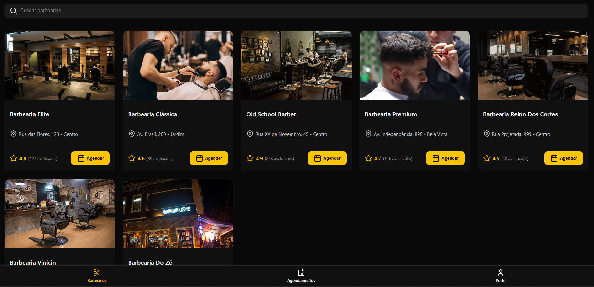
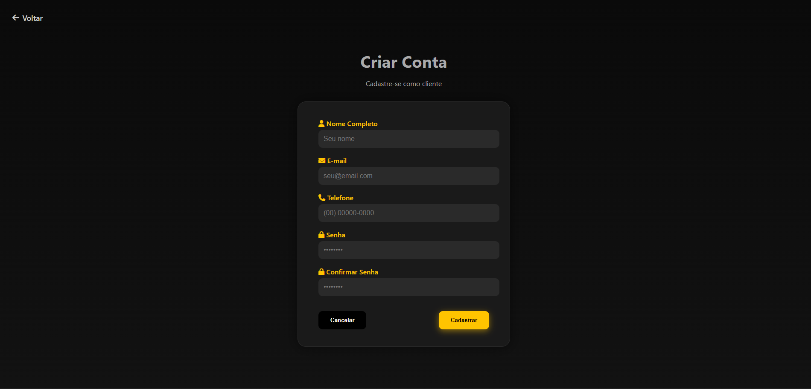
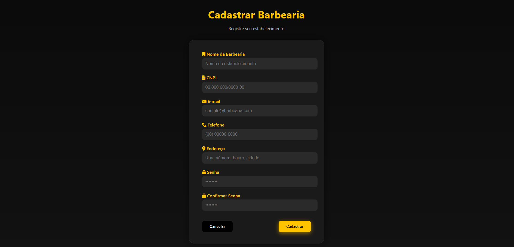

# 6. Interface do Sistema

Pré-requisitos: <a href="4-Projeto-Solucao.md"> Projeto da Solução</a>

_Visão geral da interação do usuário por meio das telas do sistema. Apresente as principais interfaces da plataforma._

## 6.1. Tela principal do sistema

_Descrição da tela principal do sistema._

## 6.2. Telas do processo 1

Formulário de criação de conta para cliente, contendo campos para nome completo, e-mail, telefone, senha e confirmação de senha, além dos botões Cancelar e Cadastrar, e um botão de Voltar no topo que redireciona para a tela Tipo de Acesso 

Formulário de criação de conta para barbearias, contendo campos para nome da barbearia, CNPJ, e-mail, telefone, endereço, senha e confirmação de senha, além dos botões Cancelar e Cadastrar, e um botão de Voltar no topo que redireciona para a tela Tipo de Acesso. 

## 6.3. Telas do processo 2

_Descrição da tela relativa à atividade 1._

[`Tela da atividade 1`](images/)

_Descrição da tela relativa à atividade 2._

[`Tela da atividade 2`](images/)

