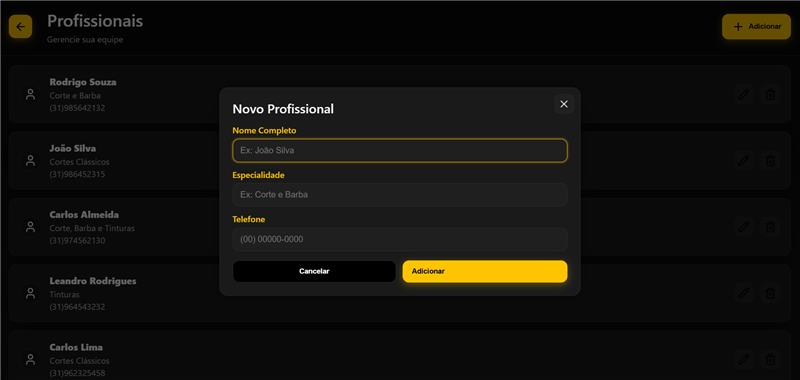
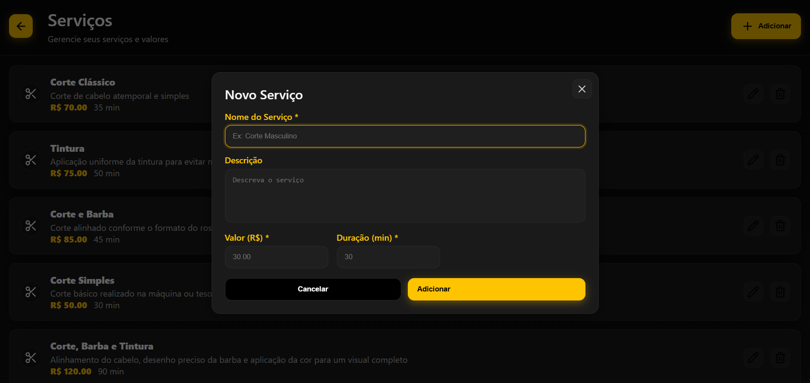
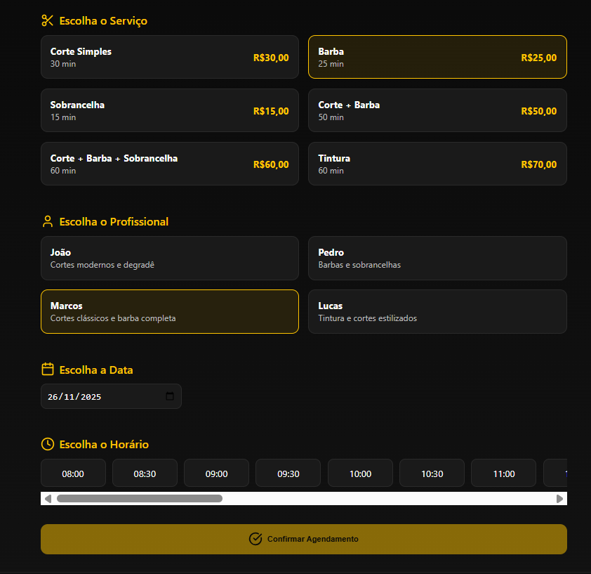
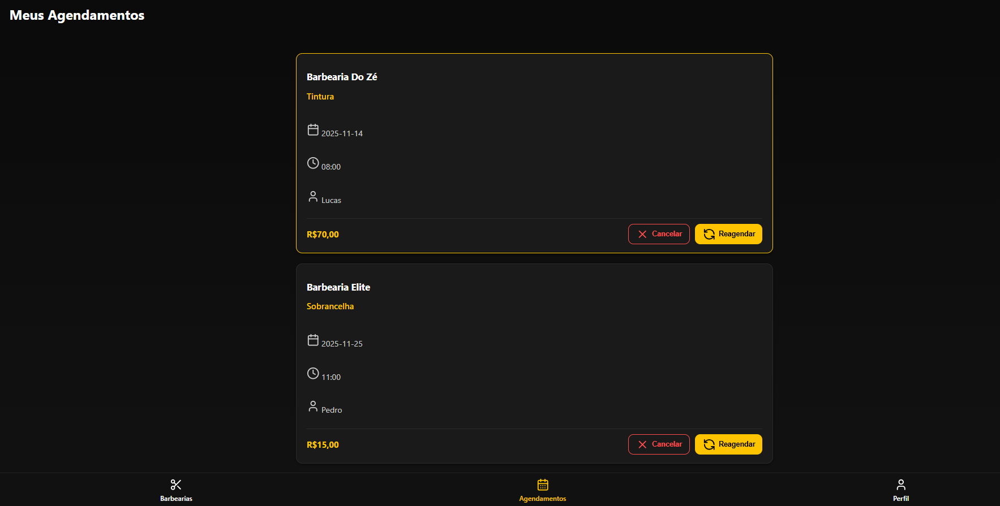
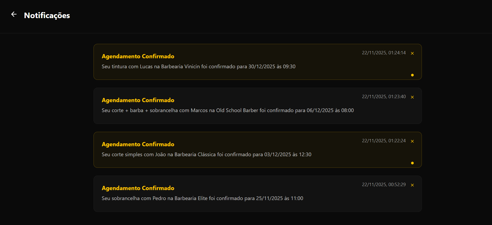
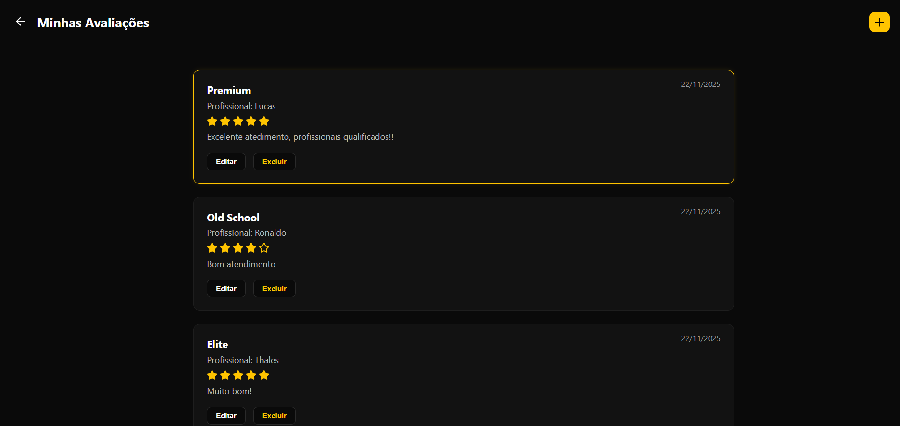

# 6. Interface do Sistema

## 6.1. Tela principal do sistema

Listagem de barbearias disponíveis para agendamento, cada uma com imagem, nome, endereço, nota, quantidade de avaliações e um botão Agendar.
Há também um campo de busca na parte superior e a barra de navegação inferior com os ícones de Barbearias, Agendamentos e Perfil.

## 6.2. Telas do processo 1

Formulário de criação de conta para cliente, contendo campos para nome completo, e-mail, telefone, senha e confirmação de senha, além dos botões Cancelar e Cadastrar, e um botão de Voltar no topo que redireciona para a tela Tipo de Acesso.

Formulário de criação de conta para barbearias, contendo campos para nome da barbearia, CNPJ, e-mail, telefone, endereço, senha e confirmação de senha, além dos botões Cancelar e Cadastrar, e um botão de Voltar no topo que redireciona para a tela Tipo de Acesso. 

## 6.3. Telas do processo 2

_Descrição da tela relativa à atividade 1._

_Descrição da tela relativa à atividade 2._

## 6.4. Telas do processo 3

_Descrição da tela relativa à atividade 1._

_Descrição da tela relativa à atividade 2._

## 6.5. Telas do processo 4

_Descrição da tela relativa à atividade 1._

## 6.6. Telas do processo 5

_Descrição da tela relativa à atividade 1._

_Descrição da tela relativa à atividade 2._