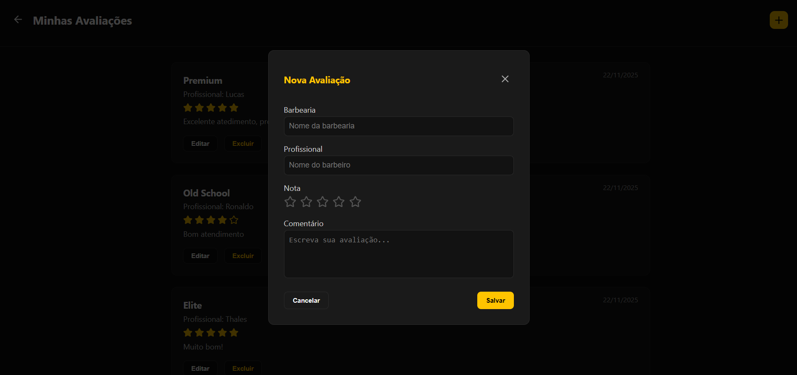

# 6. Interface do Sistema

## 6.1. Tela principal do sistema

Listagem de barbearias disponíveis para agendamento, cada uma com imagem, nome, endereço, nota, quantidade de avaliações e um botão Agendar.
Há também um campo de busca na parte superior e a barra de navegação inferior com os ícones de Barbearias, Agendamentos e Perfil.

## 6.2. Telas do processo 1

Formulário de criação de conta para cliente, contendo campos para nome completo, e-mail, telefone, senha e confirmação de senha, além dos botões Cancelar e Cadastrar, e um botão de Voltar no topo que redireciona para a tela Tipo de Acesso.

Formulário de criação de conta para barbearias, contendo campos para nome da barbearia, CNPJ, e-mail, telefone, endereço, senha e confirmação de senha, além dos botões Cancelar e Cadastrar, e um botão de Voltar no topo que redireciona para a tela Tipo de Acesso. 

## 6.3. Telas do processo 2

Lista de profissionais cadastrados e, por cima, ao clicar no botão Adicionar, um modal aberto, para adicionar um novo profissional, com campos para nome completo, especialidade e telefone, além dos botões Cancelar e Adicionar.

Lista de serviços cadastrados e, por cima, ao clicar no botão Adicionar, um modal aberto, para adicionar um novo serviço, com campos para nome do serviço, descrição, valor e duração, além dos botões Cancelar e Adicionar.

## 6.4. Telas do processo 3

Tela onde o cliente escolhe o serviço, o profissional, a data e o horário para realizar um agendamento. Cada etapa apresenta opções em cartões clicáveis, e o horário é selecionado em uma lista horizontal. Ao final, há um botão para Confirmar Agendamento.

Tela onde o cliente visualiza todos os agendamentos realizados. Cada cartão exibe a barbearia, serviço escolhido, data, horário, profissional e valor. Também possui as opções Cancelar e Reagendar.

## 6.5. Telas do processo 4

A tela exibe todas as notificações de agendamentos confirmados do cliente, listadas em cartões amplos contendo título, descrição do agendamento e data/hora da confirmação. Cada notificação possui um ícone para excluir e um indicador visual de nova mensagem quando aplicável. Um botão de voltar no topo leva o usuário de volta ao perfil.

## 6.6. Telas do processo 5

Tela onde o usuário visualiza todas as avaliações que já fez, exibindo barbearia, profissional, nota em estrelas, comentário e data. É possível editar ou excluir cada avaliação individualmente, além de adicionar novas pelo botão “+”.

A tela mostra um modal para criar uma nova avaliação, contendo campos para inserir o nome da barbearia, profissional, nota através de estrelas clicáveis e um comentário. Há botões para Cancelar e Salvar a avaliação.

