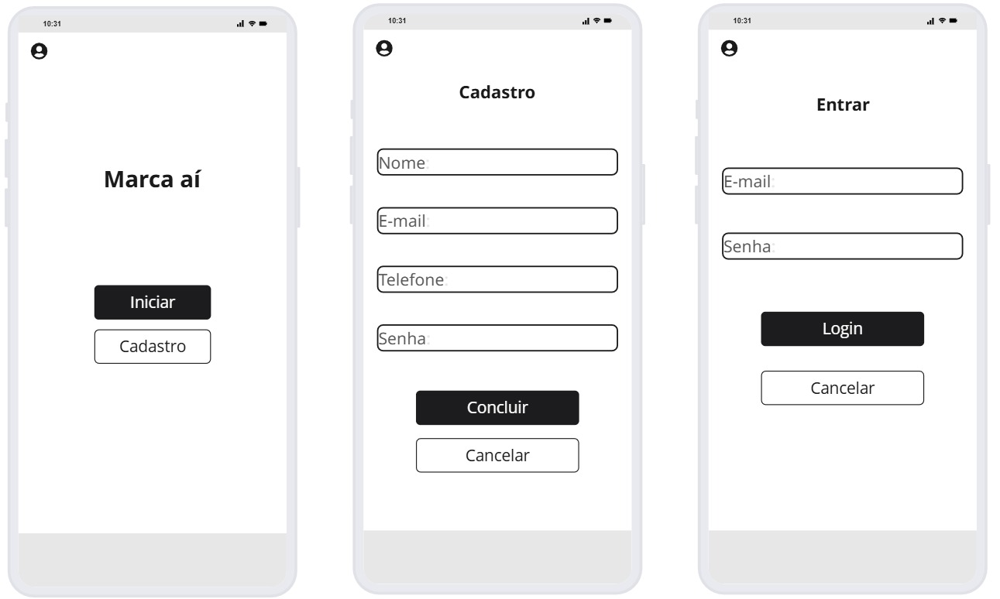

### 3.3.1 Processo 1 – CADASTRO DE USUÁRIOS

**Etapas do Processo**
01. Iniciar Cadastro na Plataforma
O cliente seleciona a opção de realizar um novo cadastro.
02. Preencher Dados do Cadastro
O cliente insere as informações solicitadas (nome, e-mail, senha, etc.).
03. Verificar Dados Informados
O sistema valida os dados fornecidos.
Decisão: Dados Corretos?
Não → o sistema retorna mensagem de dados incorretos e o cliente deve corrigir as informações.
Sim → o sistema retorna a confirmação de cadastro.
04. Armazenar na Base de Dados
Os dados corretos são registrados no banco de dados.
05. Retornar Confirmação de Cadastro
O sistema envia a confirmação ao cliente.
06. Término
O processo de cadastro é finalizado.

#### Detalhamento das atividades
**01 - Iniciar Cadastro na Plataforma**

| **Campo**       | **Tipo**         | **Restrições** | **Valor default** |
| ---             | ---              | ---            | ---               |
| botãoIniciar | Botão/Link  |   Obrigatório             |        -           |
| botãoCadastro | Botão/Link  |   Obrigatório             |        -           |

| **Comandos**         |  **Destino**                   | **Tipo** |
| ---                  | ---                            | ---               |
| Iniciar | Preencher dados do login caso já seja cadastrado  | default |
| Cadastro      |             Redireciona para a tela de cadastro                   |        default          |

**02 - Preencher Dados No Cadastro**

| **Campo**       | **Tipo**         | **Restrições** | **Valor default** |
| ---             | ---              | ---               | ---            |
| Nome            | Caixa De Texto   | Obrigatório; Somente Letras        |      _    |
| E-Mail | Caixa de Texto  |  Obrigatório; Formato de e-mail              |         _          |
| Telefone            | Número              | Obrigatório; De 9 a 11 Dígitos            |      _       |
| Senha             | Caixa De Texto             | Obrigatório; Mínimo 8 caractéres            |      _       |
| Tipo de cadastro       | Checkbox             | Obrigatório; Cliente/Barbeiro            |      _       |

| **Comandos**         |  **Destino**                   | **Tipo** |
| ---                  | ---                            | ---               |
| Concluir               | Verificar Dados Informados             | default           |
| cancelar            | Término  | cancel               |

### Wireframe

**Requisitos Atendidos:**
- RF-001	Cadastrar clientes
- RNF-001	O sistema deve ser responsivo, com adaptação automática da interface

