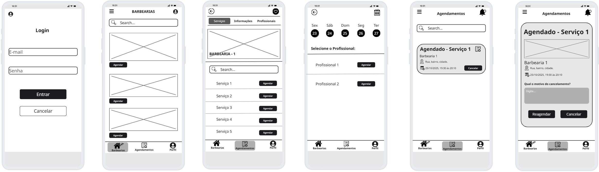

### 3.3.3 Processo 3 – AGENDAMENTO E CANCELAMENTO DE ATENDIMENTOS 

**Etapas do Processo**

01. Fazer Login
O cliente acessa o sistema com suas credenciais.

02. Escolher Atividade
O cliente seleciona a atividade que deseja realizar.

03. Decisão: Agendar Horário?
Se Sim → procurar barbearia.
Se Não → Verificar Se possui Horário Disponível

04. Procurar Barbearia
O cliente busca a barbearia onde deseja ser atendido.

05. Escolher Horário Disponível
O cliente seleciona um horário livre.

06. Escolher Serviço Desejado
O cliente escolhe o serviço que deseja realizar (exemplo: corte de cabelo, barba, combo etc.).

07. Decisão: Possui Horário Marcado?
Se Sim → Cancelar Horário.
Se Não → Retornar Erro Sem horário

08. Cancelar Horário.
O cliente cancela horário e decide se deseja remarcar.

09. Decisão: Deseja Remarcar:?
Se Sim → Procurar Barbearia.
Se Não → Término

10. Término
O processo se encerra.

#### Detalhamento das atividades

**Fazer Login**

| **Campo**       | **Tipo**         | **Restrições** | **Valor default** |
| ---             | ---              | ---               | ---            |
| Email | Caixa de Texto  |  Obrigatório;               |         _          |
| Senha             | Caixa De Texto             | Obrigatório; Mínimo 8 caractéres            |      _       |

| **Comandos**         |  **Destino**                   | **Tipo** |
| ---                  | ---                            | ---               |
| Entrar            | Escolher Atividade              | default           |
| cancelar            | Término  | cancel               |

**Escolher Atividades**

| **Campo**       | **Tipo**         | **Restrições** | **Valor default** |
| ---             | ---              | ---            | ---               |
| Tipo De Atividade | Seleção Única  | Obrigátorio; Opções Agendar e Cancelar              |  Agendar                 |

| **Comandos**         |  **Destino**                   | **Tipo**          |
| ---                  | ---                            | ---               |
| Continuar                  | Decisão "Agendar Horário                            | default               |

**Procurar Barbearia**

| **Campo**       | **Tipo**         | **Restrições** | **Valor default** |
| ---             | ---              | ---            | ---               |
| Localização | Caixa De Texto  | Obrigátorio; |  -                 |
| Nome Da Barbearia               | Caixa De Texto                | Opcional               |     -             |

| **Comandos**         |  **Destino**                   | **Tipo**          |
| ---                  | ---                            | ---               |
| Buscar                | Escolher Horário Disponível                            | default               |
| Cancelar            | Término  | cancel               |

**Escolher Horário Disponível**

| **Campo**       | **Tipo**         | **Restrições** | **Valor default** |
| ---             | ---              | ---            | ---               |
| Data | Data  | Obrigátorio; Não pode ser passado |  Data Atual                 |
| Horário                | Hora                 | Dentro dos horários livres na agenda               |  -                |          

| **Comandos**         |  **Destino**                   | **Tipo**          |
| ---                  | ---                            | ---               |
| Confirmar Horário                | Escolher Serviço Desejado                            | default               |
| Voltar            | Procurar Barbearia  | cancel               |

**Escolher Serviço Desejado**

| **Campo**       | **Tipo**         | **Restrições** | **Valor default** |
| ---             | ---              | ---            | ---               |
| Serviço | Seleção Única  | Obrigátorio; |  -                 |
| Observações                | Área de Texto                 | Opcional              |  -                 |

| **Comandos**         |  **Destino**                   | **Tipo**          |
| ---                  | ---                            | ---               |
| Confirmar                | Término                            | default               |
| Voltar           | Escolher Horário Disponível  | cancel               |

**Cancelar Horário**

| **Campo**       | **Tipo**         | **Restrições** | **Valor default** |
| ---             | ---              | ---            | ---               |
| Motivo | Área De Texto  | Obrigátorio; |  -                 |
| Remarcar | Seleção Única  | Obrigátorio; |  -                 |

| **Comandos**         |  **Destino**                   | **Tipo**          |
| ---                  | ---                            | ---               |
| Confirmar Cancelamento               | Término                           | default               |
| Voltar            | Escolher Atividade  | cancel               |

### Wireframe

