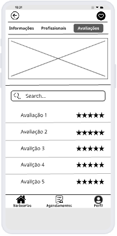

### 3.3.5 Processo 5 – AVALIAÇÃO E FEEDBACK

**Etapas do Processo**

01 - Iniciar Avaliação: O cliente acessa a opção de avaliar o serviço concluído.

02 - Preencher Dados da Avaliação: O cliente informa a nota.

03 - Verificar Dados Informados: O sistema valida os dados.

04 - Dados corretos?: Não → Solicita correção. / Sim → Prossegue.

05 - Armazenar na Base de Dados: O sistema registra a avaliação.

06 - Retornar Confirmação: O sistema confirma o envio da avaliação ao cliente.

07 - Término: O processo é finalizado.

(./images/Processo5.png)

#### Detalhamento das atividades
**01 - Iniciar Avaliação**

| **Campo**       | **Tipo**         | **Restrições** | **Valor default** |
| ---             | ---              | ---            | ---               |
| botãoAvaliar | Botão/Link  |   Obrigatório             |        -           |

| **Comandos**         |  **Destino**                   | **Tipo** |
| ---                  | ---                            | ---               |
| Avaliar | Preencher dados da avaliação  | default |

**02 - Preencher Dados da Avaliação**

| **Campo**       | **Tipo**         | **Restrições** | **Valor default** |
| ---             | ---              | ---            | ---               |
| Nota | Rating (1 a 5 estrelas)  |   Obrigatório             |        -           |

| **Comandos**         |  **Destino**                   | **Tipo** |
| ---                  | ---                            | ---               |
| Enviar | Verificar Dados Informados | default |
| Cancelar | Término | cancel |

**03 - Verificar Dados Informados**

| **Campo**       | **Tipo**         | **Restrições** | **Valor default** |
| ---             | ---              | ---            | ---               |
| Validação automática | Sistema  |   Verificar preenchimento obrigatório        |        -           |

| **Comandos**         |  **Destino**                   | **Tipo** |
| ---                  | ---                            | ---               |
| Dados Incorretos | Preencher Dados da Avaliação | retorno |
| Dados Corretos | Armazenar na Base de Dados | default |

**04 - Armazenar na Base de Dados**

| **Campo**       | **Tipo**         | **Restrições** | **Valor default** |
| ---             | ---              | ---            | ---               |
| Avaliação | Registro no Banco |   Obrigatório; vinculado ao serviço e usuário        |        -           |

| **Comandos**         |  **Destino**                   | **Tipo** |
| ---                  | ---                            | ---               |
| Salvar | Retornar Confirmação | automático |

**05 - Retornar Confirmação**

| **Campo**       | **Tipo**         | **Restrições** | **Valor default** |
| ---             | ---              | ---            | ---               |
| Mensagem de Sucesso | Texto |   Exibição obrigatória        |        “Avaliação enviada com sucesso!”           |

| **Comandos**         |  **Destino**                   | **Tipo** |
| ---                  | ---                            | ---               |
| Finalizar | Término | automático |

### Wireframe

